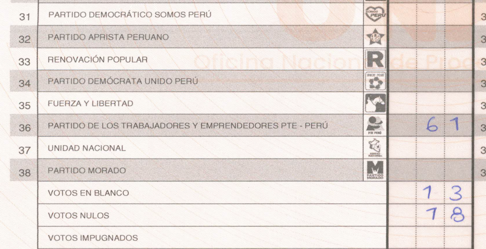

# Auditoría ONPE 2026 — Tracker Independiente

Herramienta ciudadana que captura el total nacional publicado por ONPE y lo cruza contra la suma mesa por mesa para detectar desfases. Incluye descarga de PDFs escaneados de cada acta para validación humana.

## Qué hace

1. **Scraper horario nacional** (`scraper.py`) captura el agregado presidencial / senadores / parlamento andino desde el endpoint público de ONPE.
2. **Scraper mesa-a-mesa** (`scraper_actas.py`) — arquitectura de múltiples fuentes con selección automática:
   - `mesa_search`: descarga directa del endpoint ONPE iterando `GET /actas/buscar/mesa?codigoMesa=NNNNNN` (~20 req/s con aiohttp + headers CORS), 86K actas en ~15 min
   - `prime_csv`: mirror del CSV público de [PRIME INSTITUTE](https://primeinstitute.com/onpe/) como fallback
   - `onpe_oficial`: monitor de `datosabiertos.gob.pe` para el dataset oficial post-electoral (cuando se publique)
3. **Cross-validator** (`cross_validate.py`) — cuando existen ≥2 fuentes, diff mesa-a-mesa y flag de tampering.
4. **Análisis cruzado** (`analyze_actas.py`) — suma mesa-a-mesa vs nacional, por candidato y por departamento.
5. **Detector de anomalías** (`anomalies.py`) — reglas: suma interna inconsistente, emitidos > electores, desfase desproporcionado por candidato, cambios entre snapshots, actas desaparecidas, source_mismatch.
6. **Dashboard estático** (`dashboard/index.html`) — vista pública con badges de fuente y hash de integridad.

## Arquitectura

```
scraper.py                ──▶  snapshots + candidates (nacional)
scraper_actas.py          ──▶  selecciona strategy auto
  │
  ├─ sources/mesa_search   ─▶  ONPE directo, aiohttp + cookies
  ├─ sources/prime_monitor ─▶  mirror PRIME CSV
  └─ sources/datosabiertos ─▶  dataset oficial (placeholder)
                │
                ▼
         actas_snapshots + actas + acta_votos
                │
                ▼
  analyze_actas.py  ──▶  desfase por candidato y depto
  anomalies.py      ──▶  anomalies (5 reglas)
  cross_validate.py ──▶  source_mismatch entre fuentes
  build_dashboard_data.py ──▶ dashboard/data/latest.json
  dashboard/index.html ──▶  HTML estático (Tailwind CDN)
```

Todo persiste en `data/onpe.db` (SQLite, WAL mode).

## Fuentes de datos

| Strategy | Priority | Cómo obtiene | Estado | Cobertura |
|---|---:|---|---|---|
| `onpe_oficial` | 10 | CKAN API de `datosabiertos.gob.pe` | Esperando publicación dataset 2026 | ? |
| `mesa_search` | 20 | `GET /presentacion-backend/actas/buscar/mesa?codigoMesa=NNNNNN` | **Activa** | 86K+ actas |
| `prime_csv` | 50 | Mirror del CSV público de PRIME | **Activa (fallback)** | 86,111 actas (snapshot 17-abr) |

El runner (`scraper_actas.py`) elige la strategy de menor priority que pase `probe()`. Cada ejecución crea un nuevo `actas_snapshot` etiquetado con la fuente.

## Correr

```bash
# 1. Dependencias
pip install playwright aiohttp
python -m playwright install chromium

# 2. Primer snapshot nacional
python scraper.py

# 3a. FULL scrape: descarga todas las 88K mesas (~15 min, 1x al día)
python scraper_actas.py --strategy mesa_search

# 3b. INCREMENTAL: solo mesas pendientes + sample de contabilizadas (~1 min, cada hora)
python scraper_actas.py --strategy mesa_search --incremental

# 4. Analizar cruce
python analyze_actas.py

# 5. Detectar anomalías
python anomalies.py --historical

# 6. Cross-validar fuentes (si hay ≥2)
python cross_validate.py

# 7. Validar mesas específicas descargando sus PDFs escaneados
python validate_actas.py --limit 10             # primeras 10 con mismatch
python validate_actas.py --codigo 1,100,50000   # mesas específicas
# Genera data/validation_report_*.html con tabla comparativa + links a PDFs

# 8. Generar JSON para dashboard
python build_dashboard_data.py

# 9. Ver dashboard local
cd dashboard && python -m http.server 8765
# abrir http://localhost:8765
```

En Windows el `run_hourly.bat` encadena 1→6+8. Programar con Task Scheduler para ejecutar cada hora.

## Publicación (Cloudflare Pages)

El directorio `dashboard/` es desplegable como sitio estático:

```bash
cd dashboard
npx wrangler pages deploy . --project-name elecciones-audit
```

O conectar el repo a Cloudflare Pages desde su dashboard; cada commit al `main` propaga el `latest.json` nuevo.

## Metodología y limitaciones

- **Ratio** = (% del desfase total que aporta un candidato) / (% del voto que tiene). 1.0 = proporcional. >2x = sospechoso.
- Un error técnico uniforme produce ratios cercanos a 1.0 para todos los candidatos. Un ratio 4x concentrado en un solo candidato no es explicable por error aleatorio.
- **Este tracker no concluye fraude**. Muestra números verificables. Interpretación corresponde a ONPE, JEE, JNE y observadores electorales.
- Cuando ≥2 fuentes existen, `cross_validate.py` señala discrepancias mesa-a-mesa entre ellas — fuerte indicador de tampering en al menos una de las fuentes.

## 📌 Caso de estudio: mesa 054938 (San Juan de Miraflores, Lima)

El detector `outlier_local` de `anomalies.py` marcó esta mesa con **surge y drop simultáneos** — el patrón candidato a transposición de filas. Es el outlier más extremo del país en este ciclo.

**Lo que dice el acta física** (escaneo oficial de ONPE, coincide 100% con la API — no hay alteración entre papel y sistema):



- Fila 33, **Renovación Popular**: celda **vacía** (0 votos)
- Fila 36, **PTE-Perú**: **61 votos** manuscritos

**Por qué es anómalo:**

| Métrica | Valor |
|---|---|
| Votos PTE-Perú en esta mesa | **61** — máximo absoluto nacional |
| Percentil 99 nacional de PTE-Perú | 2 votos |
| Única otra mesa del país con PTE ≥ 30 | 1 (voto en el extranjero, 36) |
| RP en las otras 9 mesas del mismo colegio (IE 6041) | promedio **58**, rango 41-67 |
| RP en esta mesa | **0** |
| P(RP=0 · n=242 · p_Lima≈0.07) | ≈ 10⁻⁸ |
| P(PTE≥61 · n=242 · p≈0.02) | ≈ 10⁻⁴⁸ |

La coincidencia numérica — desaparecen ~58 votos esperados de la fila 33 y aparecen 61 en la fila 36 — es consistente con una **transposición de filas al transcribir el acta**. Las hipótesis, de más benigna a menos:

1. Militancia local de PTE concentrada casualmente en esa mesa
2. **Error de transcripción de los miembros de mesa** (filas 33 y 36 están a 3 renglones de distancia)
3. Transposición intencional
4. Manipulación coordinada

**Este repositorio no concluye cuál.** Documenta el hallazgo con evidencia primaria reproducible: cualquiera puede descargar la misma acta del portal público de ONPE y verificar cada número. A escala nacional, la misma regla detectó **169 mesas con el patrón surge+drop simultáneo**; los candidatos grandes dominan sistemáticamente la columna de *drops* y los partidos pequeños la de *surges*. La regularidad del patrón — no un caso individual — es lo que amerita revisión por las autoridades electorales.

*Nota: el recorte mostrado excluye deliberadamente la sección del acta con nombres y DNI de los miembros de mesa.*

## 📌 Caso de estudio 2: el desfase de 3.96x

El hallazgo insignia del proyecto, replicado con datos propios e independientes de los de PRIME Institute.

**El fenómeno:** el total nacional que publica ONPE y la suma mesa por mesa de sus propias actas no coinciden (lo esperable durante el escrutinio: hay actas aún no contabilizadas). Lo que **no** es esperable es cómo se reparte esa diferencia entre candidatos.

**Números del detector `disproportionate_delta`** (18-abr-2026, 92,700 actas, ~93% de escrutinio):

| Métrica — Juntos por el Perú (Sánchez) | Valor |
|---|---|
| Total nacional oficial | 1,880,266 |
| Suma mesa a mesa (fuente propia) | 1,656,101 |
| **Desfase** | **224,165 votos** |
| Participación en el voto | ~11 % |
| Participación en el desfase total | **43.1 %** |
| **Ratio** | **3.96x** |
| Ratio reportado por PRIME (fuente independiente) | 4.05x |

Un desfase distribuido proporcionalmente da ratio ≈ 1.0 para todos (y así ocurre con el resto de candidatos grandes). Los demás ratios > 2x detectados corresponden todos a partidos pequeños (< 1.6 % del voto), donde el ruido estadístico pesa más.

**Lecturas posibles, en orden de benignidad:**

1. **Sesgo geográfico del conteo**: si las actas que faltan contabilizar se concentran en regiones donde Sánchez es fuerte (sur andino, zonas rurales de conteo lento), el desfase lo sobrerrepresentaría de forma transitoria. Verificable: el ratio debe converger a 1.0 al llegar el escrutinio a 100 %.
2. Diferencias sistemáticas entre el agregador nacional y las actas individuales — requeriría explicación técnica de ONPE.

**Este repositorio no concluye cuál.** Publica la metodología y el código para que cualquiera reproduzca el cálculo contra las fuentes públicas. Dos fuentes independientes (PRIME y este scraper) obtienen el mismo ratio, lo que descarta error de una de las fuentes; la pregunta pendiente es la serie temporal hacia el 100 % de escrutinio.

## Endpoint ONPE — breakthrough técnico

El endpoint `GET /presentacion-backend/actas/buscar/mesa?codigoMesa=NNNNNN` (código padded a 6 dígitos como **string**, no integer) retorna JSON con todas las elecciones por mesa (presidencial, senadores, diputados, parlamento andino). Requiere headers `Origin`, `Referer` y `sec-fetch-*` para evitar que el gateway devuelva HTML del SPA. Las cookies se obtienen vía Playwright bootstrap.

Esto permite descargar nuestra propia copia de las 86K actas sin depender del CSV de PRIME.

## Integridad

Cada snapshot del dashboard incluye un `integrity_sha256` calculado sobre los campos estructurales (candidatos + desglose por departamento). Permite verificar que el JSON no fue alterado post-generación.

## Licencia

MIT. Metodología y código abiertos. Datos de ONPE usados bajo sus condiciones públicas.
